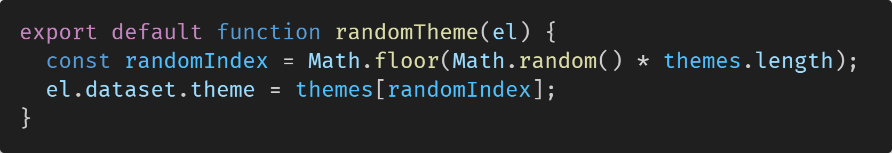

# Absurd Quiz App
*A fun quiz app that generates quizzes on request with OpenAI.*

 

## About
**URL:** https://absurd-quiz-app-production.up.railway.app/  
**Created by:** [Mike Newberry](https://github.com/MikeNewXYZ)

**_This project was created as part of an assignment for a coding course. The bulk of it was made quickly across 2 days. It uses HTML, Tailwind CSS, DaisyUI, JavaScript, OpenAI API, NodeJS and ExpressJS._**

 

## How it works!

### 🎨 So many styles??!?!

I had the slightly crazy idea that the style of the page should change on every refresh and also with user interaction. This was achived by using DaisyUI which comes with a huge array of preset themes. All I had to do then was to set a different theme on page initialization and whenever else I felt like it. This is done with a very simple function that you can see above.

## 🤖 How are the questions generated?

The quiz is generated using ChatGPT, specifically using the "GPT 3.5 Turbo" model, using the OpenAI API. It simply takes in [instructions from a text file](./server/instructions.txt) and using that outputs a response in JSON. The response should contain an array of 5 questions all with a title and answers array.

## 🕺 How is the end sequence animated?

The terminal from the end sequence is simply a component from DaisyUI. The animations however, was created using an [NPM library called typewriter-effect](https://www.npmjs.com/package/typewriter-effect). It has a very simple but powerful API allowing me to quickly build the fun end animation. The .callFunction method allowing me to call the "jsConfetti.addConfetti()" function as much as I so pleased.

